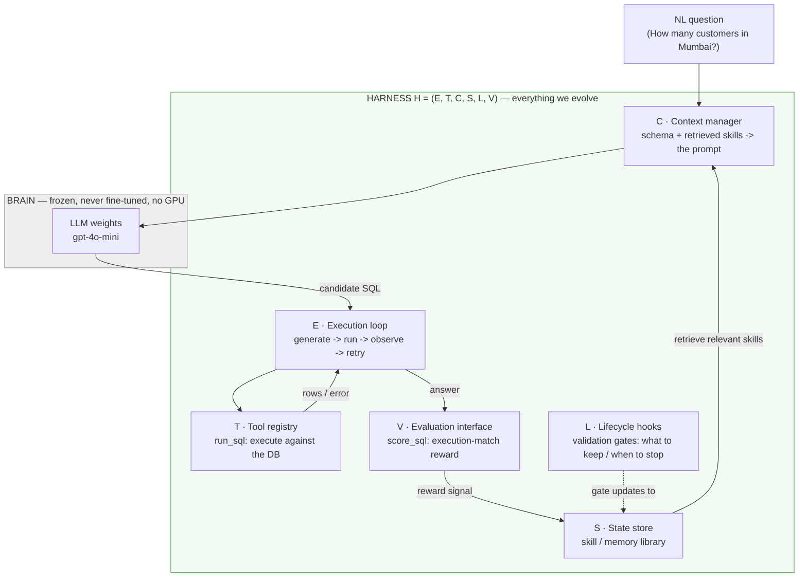
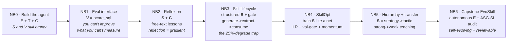
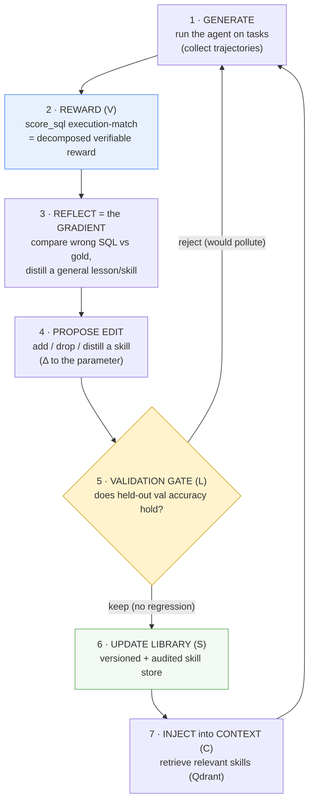
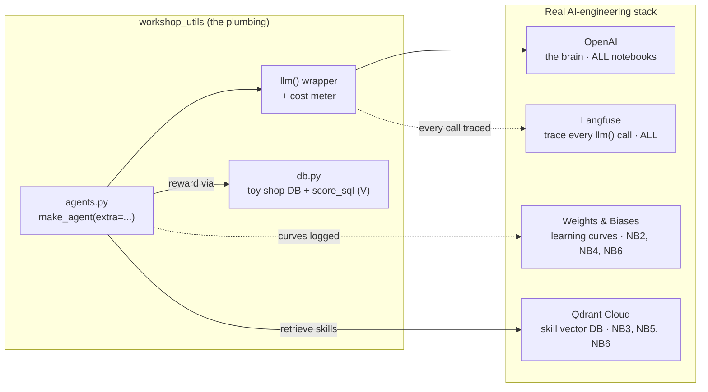
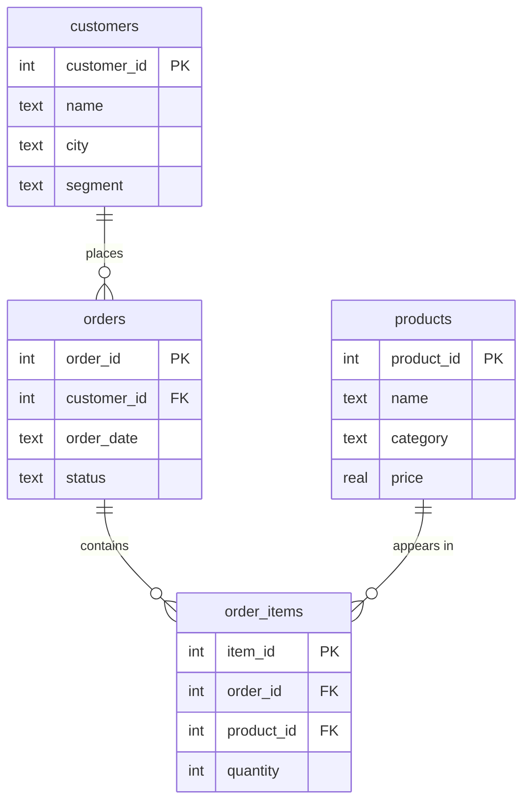

# Workshop Architecture: Self-Evolving Agents by Optimizing the Harness

> **The one thesis:** an agent = a **frozen brain** + an **evolving harness**.
> We never touch the model weights (that needs a GPU). We make the agent *learn*
> by optimizing everything *around* the brain - its prompt, tools, memory, and
> control loop - in **text space**, on a laptop.
>
> **Reflection is the gradient · the skill document is the parameter vector · the
> eval set is the loss.**

This document is the map. It connects all seven notebooks (NB0 -> NB6) into one
picture and shows how each one builds or evolves a piece of the agent.

> 🖼️ **Slide-ready exports** (SVG + PNG) of every diagram below live in
> [`docs/diagrams/`](docs/diagrams/).

---

## 1. The anatomy of the agent: `H = (E, T, C, S, L, V)`

Every agent in this workshop is the same frozen LLM wrapped in a harness with six
named parts. The harness is the product; the brain is a fixed component.

**Read it as a loop:** the brain proposes SQL, the execution loop runs the tool and
observes the result, the evaluation interface turns the result into a reward, the
reward updates the skill library, and the library feeds back into the context the
brain sees next time. The lifecycle hooks decide which updates are allowed in.
**The weights never move - the loop does the learning.**

---

## 2. The notebook journey: build it, then evolve it

NB0 *builds* the first agent (E, T, C). Every notebook after that *evolves* one
part of the harness. The accuracy on a held-out test set is the scoreboard.

| NB | Title | Harness part built / evolved | The new idea |
|---|---|---|---|
| **NB0** | Build your first agent | **E, T, C** (S, V named but empty) | agent = brain + harness; the loop handles *crashes* for free |
| **NB1** | The eval interface | **V** | an objective, replayable reward (execution match) - the prerequisite for all learning |
| **NB2** | Reflexion | **S + C** | learn from mistakes as natural-language lessons; *reflection is the gradient* |
| **NB3** | The skill lifecycle | structured **S** + **L** | skills are *structured & retrieved*; an unvetted pool degrades (~25%) -> you need a gate |
| **NB4** | SkillOpt | optimize **S** | the skill document is a *trainable parameter*: learning rate, **validation gate**, momentum |
| **NB5** | Hierarchy + transfer | **S** structure | strategy->tactic retrieval; a strong model's skills *transfer* to a weak one |
| **NB6** | Capstone | evolved **E** (+ S, L, V) | an autonomous evolutionary loop with an **audit trail** - self-improvement you could ship |

---

## 3. The engine: the self-evolution loop (RL without gradients)

This is the heart of the workshop. It is reinforcement learning where the
**policy is the harness** and the learning signal is **verbal/evolutionary
feedback** instead of backprop. NB2 runs one turn of it by hand; NB4 makes it an
optimizer; NB6 makes it autonomous.

**The ML analogy, made literal:**

| Neural-net training | This workshop (text space) | Where |
|---|---|---|
| parameter vector θ | the **skill document** (list of skills in the prompt) | NB2-NB6 |
| loss | **error on a held-out eval split** | NB1 (V) |
| gradient | a **reflection** that proposes a skill edit | NB2 |
| learning rate | how many edits we accept per step | NB4 |
| regularization / early stop | the **validation gate** that blocks pollution | NB3, NB4 |
| momentum | the library **persists and compounds** | NB4 |
| population / evolution | EvoSkill mutate + select across generations | NB6 |
| training run dashboard | **Weights & Biases** curves | NB2, NB4, NB6 |

The gate (step 5) is the load-bearing idea: it is the difference between *learning*
and *accumulating junk*, and it is exactly what defuses NB3's 25%-degrade trap.

---

## 4. The real-world tool stack

The workshop runs the way an AI engineer actually works - a live observability +
experiment-tracking + vector-DB stack, not in-memory stubs. One wrapper (`llm()`)
is the choke point everything is instrumented through.

| Tool | Role | Used in |
|---|---|---|
| **OpenAI** | the frozen brain (`gpt-4o-mini`; `gpt-4o` as teacher in NB5) | all |
| **Langfuse** | traces every `llm()` call = "collect trajectories" | all |
| **Weights & Biases** | logs the agent's "training" curves | NB2, NB4, NB6 |
| **Qdrant Cloud** | managed vector DB for skill retrieval (RAG) | NB3, NB5, NB6 |

---

## 5. The task spine: text-to-SQL (why it works)

Every notebook uses one task: translate a natural-language question into SQLite
over a toy "shop" DB (`customers -> orders -> order_items -> products`).

Text-to-SQL is the spine because it is **auto-scorable** (execute predicted vs gold
SQL and compare result sets - no LLM judge), **skills compound** (join patterns,
the `status='completed'` revenue rule, set-difference idioms are obviously
reusable), and it's free, fast, and offline. That auto-scorability is what makes
`V` an *objective* reward, which is what makes the whole self-evolution loop possible.

---

## TL;DR for the room

1. **Agent = frozen brain + harness.** We optimize the harness, never the weights.
2. **`H = (E, T, C, S, L, V)`** names the parts; NB0 builds E/T/C, the rest evolve S via V.
3. **The loop is RL in text:** reflection is the gradient, the skill doc is the
   parameter, the eval set is the loss - and the **validation gate** keeps it honest.
4. **It's auditable and cheap:** every gain traces to a measured reward (NB6), and a
   full run costs cents on a laptop. No GPU, ever.
