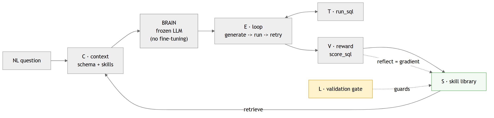
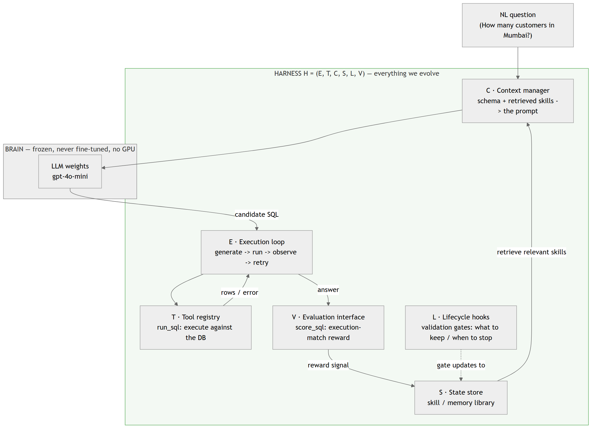
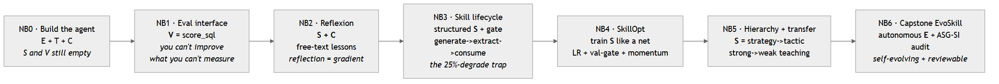
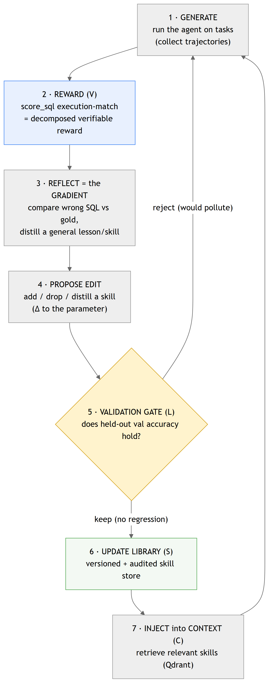
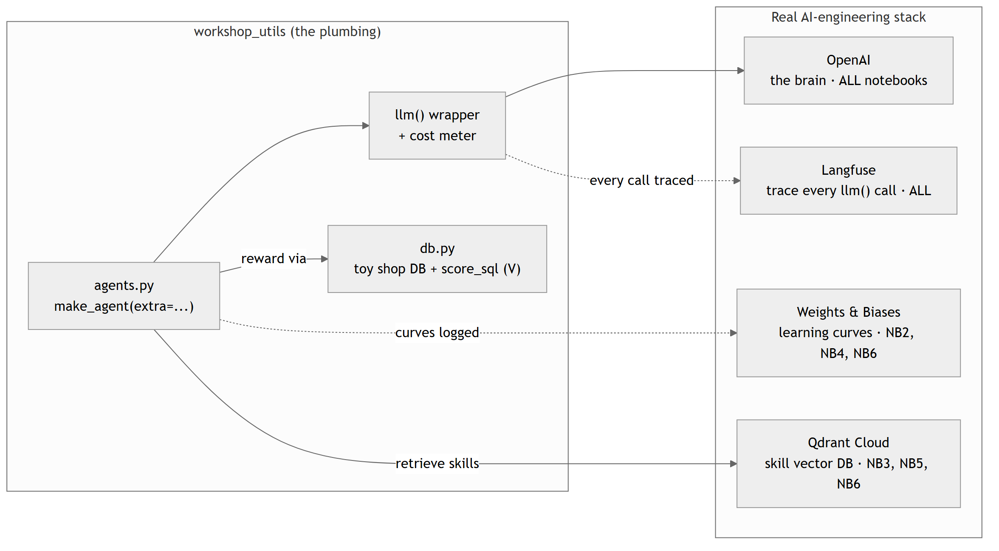
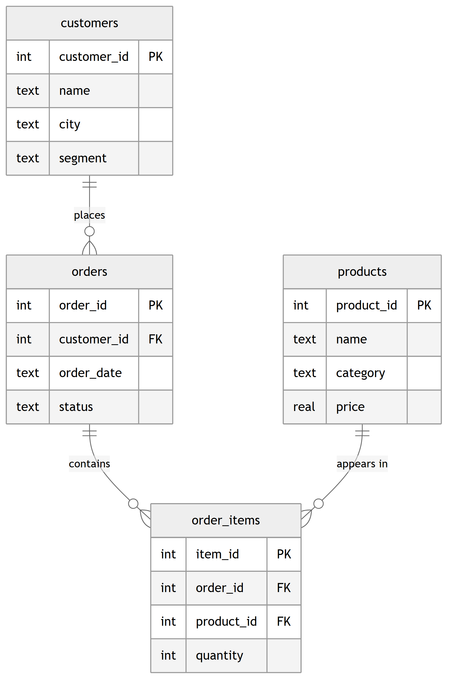

# Slide-ready diagrams

Exported from the Mermaid sources in [`../../ARCHITECTURE.md`](../../ARCHITECTURE.md)
and the README. Each diagram is provided as **SVG** (vector - crisp at any size,
best for slides) and **PNG** (3x scale - easy to paste anywhere).

To re-export after editing the diagrams:

```bash
npx -y @mermaid-js/mermaid-cli -i ARCHITECTURE.md -o docs/diagrams/arch.svg -t neutral -b white
```

| # | Diagram | Files |
|---|---|---|
| 00 | Big-picture overview (frozen brain + learning loop) | `00-overview.svg` / `.png` |
| 01 | Agent anatomy `H = (E, T, C, S, L, V)` | `01-agent-anatomy.svg` / `.png` |
| 02 | The NB0 -> NB6 journey | `02-notebook-journey.svg` / `.png` |
| 03 | The self-evolution loop (RL in text) | `03-self-evolution-loop.svg` / `.png` |
| 04 | The real tool stack | `04-tool-stack.svg` / `.png` |
| 05 | Text-to-SQL schema (the task spine) | `05-text-to-sql-schema.svg` / `.png` |

---

### 00 · Big-picture overview


### 01 · Agent anatomy


### 02 · The NB0 → NB6 journey


### 03 · The self-evolution loop


### 04 · The tool stack


### 05 · Text-to-SQL schema

